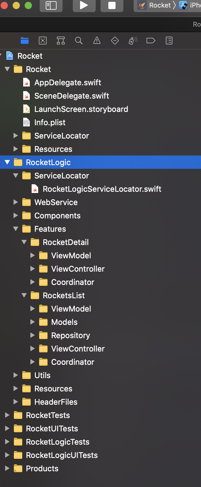
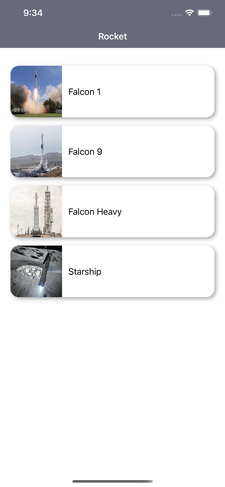
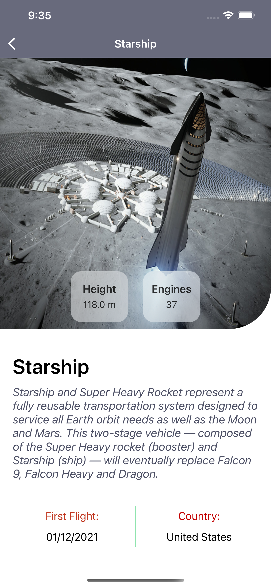
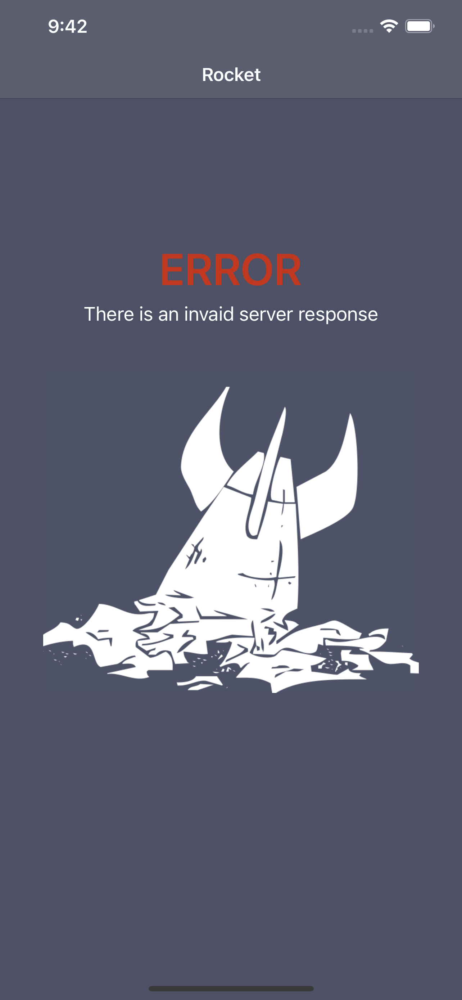

# ROCKETS APP

The main purpose of this app is to show all the listed rockets obtained from the API: https://github.com/r-spacex/SpaceX-API

At this point, you can see that its a simple two screen app where we'd applied different type of knowledgement. Let's see!

## Characteristics 
Firstly, we have to know what type of app we want to do and what goals do you want to achieve with. Here are the main goals:

* Written in Swift 5
* Supported iOS varsion 14
* Code rules with SwiftLint
* Implement views by code or by Xib
* Testability (currently, 94% of coverage)
* Reusability
* Use patterns and clean code

## APP Architecture
When you have to start bulding a new app, you ask yourself what is the best architecture to use. This decision should be based on the requeriments and future expectatives. In this case, it's a very simple app that show only two screens, so we can use a MVC pattern. In MVC patterns, UIViewControllers are the mediators between the view and the model. This pattern put all the logic in the viewController, make it hard to test and mantain. However, is a nice pattern when you want to make an app faster. You need to initialize with few files. For this reason, I didn't chose this pattern and we'd follow MVVM pattern where introduces a new mediator: the View Model. All the business logic will be in the viewModel and this will notify the chances to the viewcontroller. ViewController and Models do not never interact directly.

This project have the follow structure

(https://github.com/miquelbosch/rocket/blob/develop/Resources/Pictures/structure.png)

I created a Framework for the app, in therms to reuse all the code between targets. For example, if we want to create widgets we can reuse the viewModels Logic to show the info in the widget. 

Another patterns or rules that we'd followed are: don't use any third resource (libraries) and don't use the api keys to allow an instantly installation(clone) + run app. Also, with the purpose of practise and show my iOS skills I wanted to create the views programatically for RocketListViewController and Nibs for DetailViewController.

## First Screen: Rockets List
It's the main screen of the app who call the service and show the results in a tableView. I created a protocol to update the view, allowing to stablish the connection between the view controller and the view model. 

(https://github.com/miquelbosch/rocket/blob/develop/Resources/Pictures/rockets_list.png)

We'd handled the errors, you can see in the Error Handle section.

For the image load, as I said previously, I didn't use any third library. I experiment that this api, without keys allways return a short list of rockets. For this reason, I didn't used any third party or make a strong image loader with cache, it's simple for this particular case. If you run the app the first load will be slightly slower than if you run several times the app. 

## Second Screen: Rocket Detail
With the coordinator I pass the data that we have to show to the user. Here, we'd implemented an animation that only will be displayed if the image is loaded successfully.

(https://github.com/miquelbosch/rocket/blob/develop/Resources/Pictures/rocket_detail.png)

## Error Handle
When we have some detected error in the app I use a enum called ErrorResponse to classificate the type of error and show it to the user.

(https://github.com/miquelbosch/rocket/blob/develop/Resources/Pictures/error.png)

## Test
I tested the app: the extensions, view models, flows of view controllers. Finally, I covered 94% of code, not bad. 

